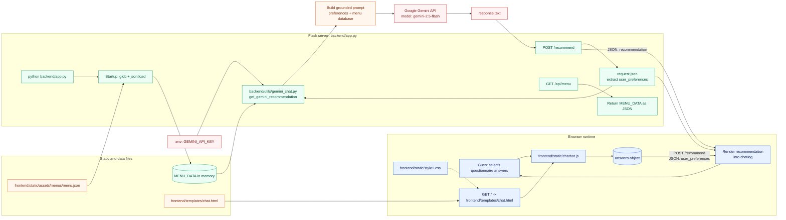

 # Product Requirements Document: AI Waiter

## 1. Product Overview

AI Waiter is a conversational restaurant assistant that helps guests browse a menu, receive personalized recommendations, place orders, and request assistance through a simple chat-based interface. It supports restaurant staff by reducing repetitive questions and improving order accuracy.

### Technical Prototype Flow

The current prototype is a Flask application with a browser-based questionnaire. The diagram below shows the files, runtime boundaries, data flow, and external service call that implement the recommendation flow.

**Runtime summary:** Flask renders `chat.html` and serves its static assets. On startup, `app.py` reads `menu.json` into `MENU_DATA`. After the guest completes the questionnaire, `chatbot.js` sends the answers to `/recommend`; `app.py` passes those answers and `MENU_DATA` to `gemini_chat.py`, which calls Gemini and returns the generated recommendation to the browser. The current prototype does not yet implement cart, order submission, or staff-dashboard requests.

## 2. Problem Statement

Restaurant guests may have difficulty understanding menus, identifying suitable dishes, communicating dietary requirements, or getting timely service during busy periods. Restaurants need an efficient way to provide consistent assistance without replacing human staff.

## 3. Goals

- Provide fast, friendly, and accurate menu assistance.
- Recommend dishes based on preferences, allergies, dietary restrictions, and budget.
- Enable guests to create and review an order before submitting it.
- Clearly communicate uncertainty and escalate to staff when needed.
- Give restaurant staff visibility into requests and orders.

## 4. Non-Goals

- Fully replacing waiters or restaurant management systems.
- Processing payments in the initial prototype.
- Making medical claims about allergens or nutrition.
- Supporting multiple restaurants in the initial release.

## 5. Target Users

### Guests

People dining in a restaurant who want menu information, recommendations, ordering support, or assistance.

### Restaurant Staff

Waiters and managers who need to monitor guest requests, confirm orders, and intervene when required.

## 6. Core User Stories

- As a guest, I want to view the menu so that I can decide what to order.
- As a guest, I want to ask questions in natural language so that I can understand dishes quickly.
- As a guest, I want recommendations based on my preferences and restrictions.
- As a guest, I want to add, remove, and modify items before submitting an order.
- As a guest, I want to see a clear order summary and estimated total.
- As a guest, I want to request a human waiter when the AI cannot help.
- As staff, I want to receive and update orders and assistance requests.
- As a manager, I want to update menu items, prices, availability, and allergen information.

## 7. Functional Requirements

### 7.1 Guest Experience

- Start a session using a table code, QR code, or session link.
- Display menu categories, item descriptions, prices, modifiers, availability, and allergen information.
- Accept conversational text input and suggested prompts.
- Answer questions using only approved restaurant data.
- Recommend items based on cuisine, taste, dietary needs, allergies, spice level, and price range.
- Require confirmation of allergy-related information and advise guests to verify with staff.
- Add items and modifiers to a cart.
- Validate required choices and unavailable items.
- Display subtotal, applicable taxes or fees, and total where configured.
- Allow guests to submit an order to staff.
- Show order status: draft, submitted, confirmed, preparing, ready, served, or cancelled.
- Allow requests such as water, utensils, bill, or human assistance.

### 7.2 Staff Experience

- Display incoming orders in a queue.
- Display guest assistance requests with table and time information.
- Confirm, reject, modify, or mark orders as completed.
- Update request status and notify the guest.
- Flag conversations requiring human attention.

### 7.3 Menu Management

- Create, edit, and archive categories and menu items.
- Configure prices, modifiers, ingredients, allergens, dietary tags, and availability.
- Keep an audit-friendly record of menu updates where feasible.

## 8. AI Requirements

- Use restaurant-provided menu and policy data as the primary knowledge source.
- Never invent ingredients, prices, availability, promotions, or order status.
- Ask follow-up questions when a request is ambiguous.
- State when information is unavailable and offer staff escalation.
- Preserve the guest's conversational context during a session.
- Confirm important details before submitting an order.
- Avoid claiming that an item is safe for an allergy; direct guests to staff verification.

## 9. Non-Functional Requirements

- Typical responses should appear within 3 seconds under normal load.
- The interface must be usable on mobile and desktop screens.
- Provide accessible keyboard navigation, readable contrast, and clear status messages.
- Protect personal and order data using secure authentication and encrypted transport.
- Collect only data necessary for the dining session.
- Provide logging for errors, order events, and escalations without exposing sensitive data.
- Support graceful recovery from network, AI, and staff-dashboard failures.

## 10. MVP Scope

The MVP will include a single restaurant, QR/table session entry, menu browsing, conversational menu Q&A, basic recommendations, cart management, order submission, staff order visibility, and human-assistance requests. Payments, reservations, advanced analytics, voice interaction, and multi-location support are deferred.

## 11. Success Metrics

- At least 90% of menu questions receive an accurate answer or appropriate escalation.
- At least 95% of submitted orders contain valid items and required modifiers.
- Median first response time is under 3 seconds.
- Fewer than 5% of sessions experience an unresolved technical error.
- Staff can acknowledge a request within 2 minutes during operating hours.
- Guest satisfaction and order completion rates improve compared with the current process.

## 12. Risks and Mitigations

| Risk | Mitigation |
|---|---|
| Incorrect allergen or ingredient information | Use verified menu data, prominent disclaimers, and staff confirmation. |
| Hallucinated answers | Restrict responses to approved data and escalate unknown questions. |
| Incorrect orders | Show a confirmation summary and require guest approval. |
| Staff miss urgent requests | Use visible queues, timestamps, notifications, and escalation rules. |
| Poor adoption | Keep the interface simple and retain easy access to human staff. |

## 13. Acceptance Criteria

- A guest can start a table session and browse the current menu.
- A guest can ask a menu question and receive a source-grounded response.
- A guest can create, edit, review, and submit an order.
- The system prevents ordering unavailable items and incomplete modifiers.
- Staff can view and update order and assistance-request statuses.
- Unknown, sensitive, or allergy-related questions are clearly escalated.
- The application handles failed requests without losing the guest's cart.

## 14. Future Enhancements

- Payment and POS integration.
- Multilingual and voice-based interaction.
- Reservations and waitlist management.
- Personalized loyalty experiences.
- Kitchen-display integration and operational analytics.
- Multi-restaurant and multi-location administration.
